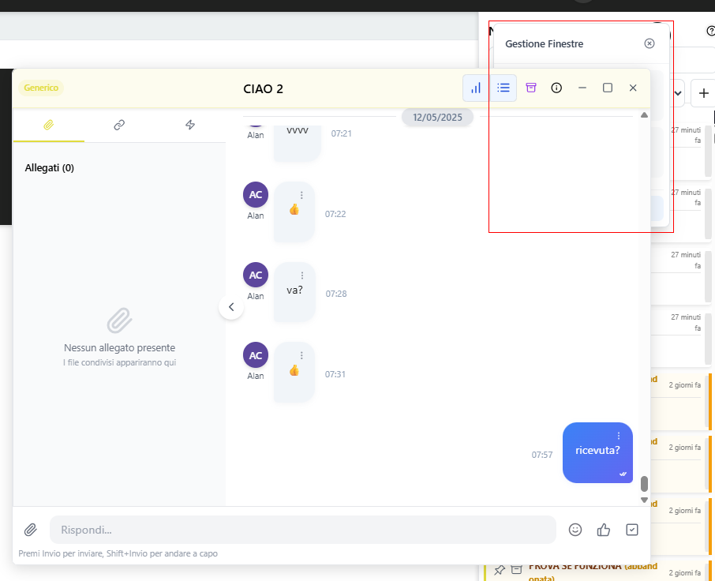
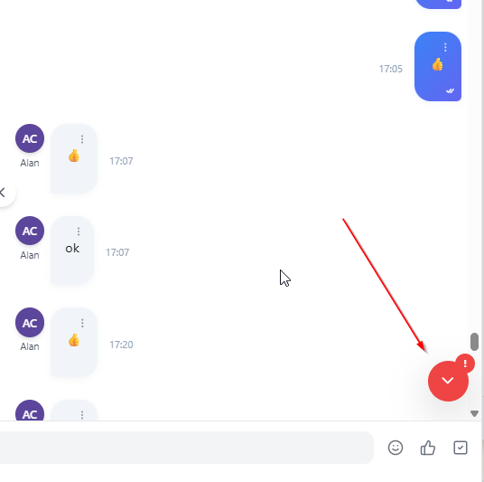

- [ ] Problema zindex sul menu layout chat quando ho almeno una modale della chat aperta

- [x] Se apro una chat e scrollo in alto (messaggi più vecchi), l'icona per tornare all'ultima notifica si colora di rosso, come se avessi ricevuto altre notifiche nel frattempo

- [x] Sistemare scroll quando arriva un messaggio

