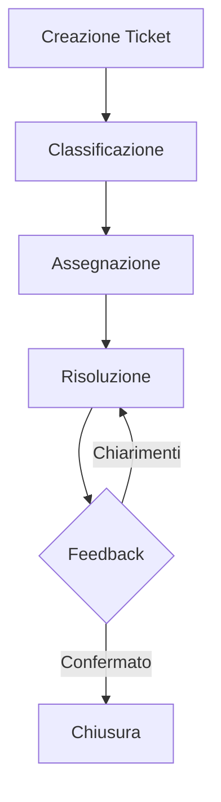
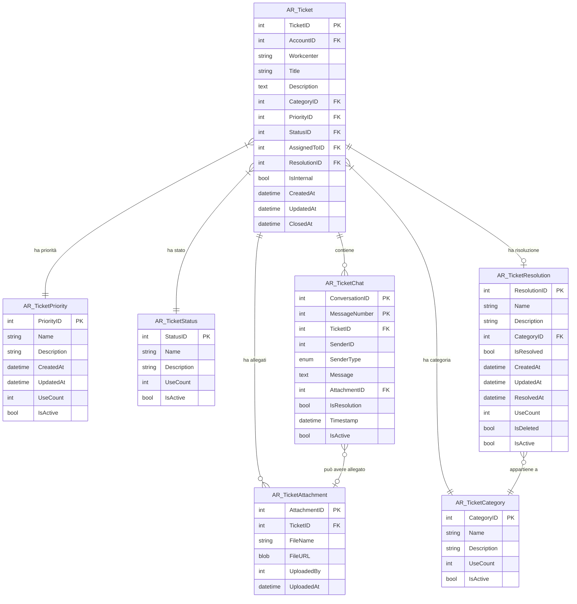

# Sistema di Gestione Problemi IT tramite Ticket

> Sistema completo per la gestione di richieste di supporto IT con funzionalità avanzate di tracciamento, classificazione automatica e risoluzione assistita da AI.

## Indice

- [Funzionalità Principali](#funzionalità-principali)
- [Workflow](#workflow)
- [Struttura Database](#struttura-database)
- [Integrazione AI](#integrazione-ai)
- [Ruoli Utente](#ruoli-utente)

## Funzionalità Principali

| Funzionalità | Descrizione |
|--------------|-------------|
| **Creazione Ticket** | Gli utenti creano ticket con descrizione, categoria, priorità e possono allegare immagini |
| **Stati Progressivi** | I ticket attraversano stati come Aperto → In lavorazione → Risolto → Chiuso |
| **Assegnazione Intelligente** | Assegnazione manuale o automatica basata su competenze e disponibilità |
| **Comunicazione Integrata** | Chat integrata per comunicazione continua tra utenti e tecnici |
| **Gestione Allegati** | Supporto per immagini con ottimizzazione dello spazio di archiviazione |
| **Filtri Avanzati** | Ricerca e filtri per workcenter, data, stato, priorità e categoria |
| **Sistema di Notifiche** | Notifiche in-app ed email per aggiornamenti importanti |
| **Storico Completo** | Registrazione dettagliata di tutte le azioni e risoluzioni |

## Workflow

1. **Creazione** - L'utente crea un nuovo ticket con i dettagli del problema
2. **Classificazione** - Il sistema (assistito da AI) classifica il problema
3. **Assegnazione** - Il ticket viene assegnato al tecnico più adatto
4. **Risoluzione** - Fase di risoluzione, termina con la chiusura del ticket. Durante questa fase può avvenire uno scambio di messaggi tra utente e tecnico (ad esempio se il problema non è stato risolto completamente) o una riassegnazione del ticket ad un altro tecnico
5. **Feedback** - L'utente conferma la risoluzione o 
6. **Chiusura** - Il ticket viene chiuso con documentazione della soluzione

## Struttura Database

Il sistema utilizza un database relazionale con le seguenti tabelle principali:

- **AR_Ticket** - Dati principali del ticket
- **AR_TicketStatus** - Stati possibili (Aperto, In attesa conferma IA, In lavorazione, Risolto, Chiuso)
- **AR_TicketCategory** - Categorie di problemi
- **AR_TicketPriority** - Livelli di priorità
- **AR_TicketChat** - Messaggi e allegati della conversazione
- **AR_TicketResolution** - Soluzioni applicate
- **AR_TicketAttachment** - Gestione degli allegati

### Schema del Database

Di seguito il diagramma delle relazioni tra le tabelle con i relativi campi:

### Descrizione delle Relazioni

- Un **Ticket** ha un solo **Stato**, **Categoria** e **Priorità**
- Un **Ticket** può avere una sola **Risoluzione** o nessuna
- Un **Ticket** può contenere molti **Messaggi** nella chat
- Un **Messaggio** nella chat può avere un solo **Allegato** o nessuno
- Un **Ticket** può avere molti **Allegati**
- Una **Risoluzione** è associata a una **Categoria** specifica

### Chiavi e Relazioni Principali

| Tabella | Campo | Relazione |
|---------|-------|-----------|
| AR_Ticket | CategoryID | → AR_TicketCategory.CategoryID |
| AR_Ticket | PriorityID | → AR_TicketPriority.PriorityID |
| AR_Ticket | StatusID | → AR_TicketStatus.StatusID |
| AR_Ticket | ResolutionID | → AR_TicketResolution.ResolutionID |
| AR_TicketChat | TicketID | → AR_Ticket.TicketID |
| AR_TicketChat | AttachmentID | → AR_TicketAttachment.AttachmentID |
| AR_TicketAttachment | TicketID | → AR_Ticket.TicketID |
| AR_TicketResolution | CategoryID | → AR_TicketCategory.CategoryID |

## Integrazione AI

Il sistema integra intelligenza artificiale per:

- **Classificazione Automatica** - Analisi del problema per determinare categoria e priorità
- **Suggerimento Soluzioni** - Proposta di soluzioni basate su casi simili precedenti
- **Assegnazione Intelligente** - Identificazione del tecnico più adatto
- **Generazione Risposte** - Assistenza nella creazione di risposte e documentazione delle soluzioni

## Ruoli Utente

- **Utenti** - Creano ticket e visualizzano lo stato dei propri ticket o del proprio workcenter
- **Tecnici IT** - Gestiscono i ticket assegnati, comunicano con gli utenti e documentano le soluzioni