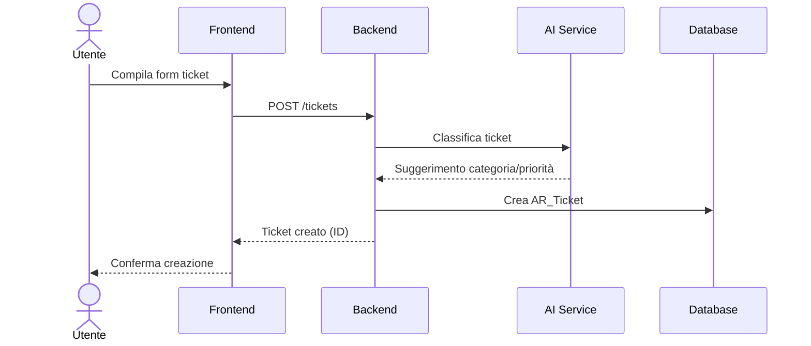
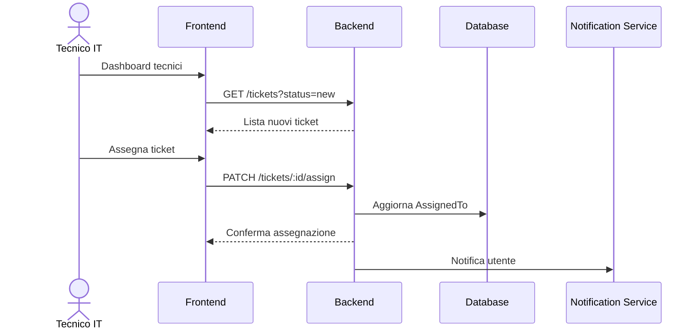
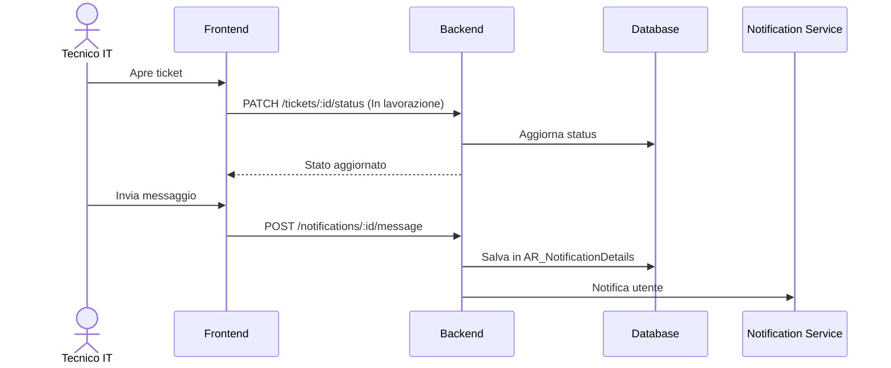
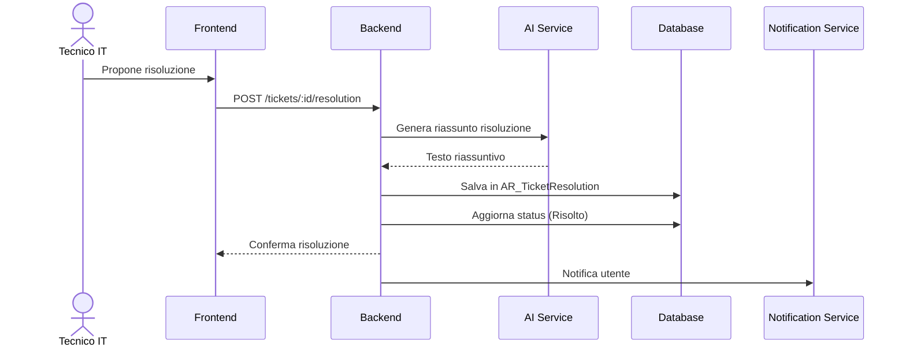
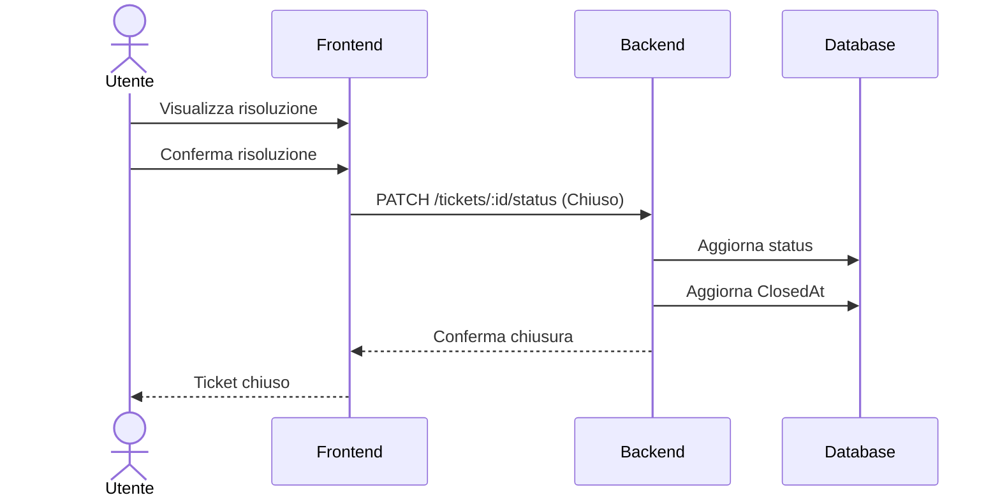

# Workflow di Sviluppo Sistema di Gestione Ticket IT

## Indice
1. [Panoramica](#panoramica)
2. [Approccio di Integrazione](#approccio-di-integrazione)
3. [Modifiche al Database](#modifiche-al-database)
4. [Modifiche Backend](#modifiche-backend)
5. [Modifiche Frontend](#modifiche-frontend)
6. [Dettaglio dei File per Step di Sviluppo](#dettaglio-dei-file-per-step-di-sviluppo)
7. [Sistema di Assegnazione Ticket con Tag](#sistema-di-assegnazione-ticket-con-tag)
8. [Stored Procedure](#stored-procedure)
9. [Flusso di Lavoro dei Ticket](#flusso-di-lavoro-dei-ticket)
10. [Integrazione AI](#integrazione-ai)
11. [Testing](#testing)
12. [Pianificazione Sprint](#pianificazione-sprint)

## Panoramica

Il Sistema di Gestione Ticket IT verrà implementato utilizzando gran parte dell'infrastruttura esistente della chat, con le necessarie modifiche per supportare il workflow e le funzionalità specifiche della gestione ticket. Questo approccio ci permette di riutilizzare componenti esistenti riducendo i tempi di sviluppo, mantenendo al contempo una UX coerente.

La principale differenza tra i sistemi di chat e ticket è il **workflow strutturato** che ogni ticket deve seguire, con stati ben definiti e tracciamento delle risoluzioni. I ticket richiederanno anche metadati aggiuntivi (categoria, priorità, ecc.) e un processo formale di apertura/chiusura.

## Approccio di Integrazione

### Riutilizzo dell'Infrastruttura Esistente
- **Interfaccia Chat**: Riutilizzeremo i componenti della chat (`ModernChat`, `ChatWindow`, `ChatTopBar`, ecc.) estendendoli con funzionalità specifiche per i ticket
- **Sistema di Notifiche**: Adatteremo il sistema di notifiche esistente per gestire le notifiche specifiche dei ticket
- **Gestione Allegati**: Riutilizzeremo il sistema di allegati per i ticket
- **UI/UX**: Manterremo coerenza visiva con miglioramenti visivi per distinguere i ticket dalle chat normali

### Estensione delle Funzionalità
- Aggiunta di metadati specifici per ticket (categoria, priorità, stato, ecc.)
- Implementazione del workflow di stati del ticket
- Integrazione dell'assistenza AI per classificazione e suggerimenti
- Sviluppo di filtri avanzati specifici per i ticket
- Implementazione dello storico di risoluzione

## Modifiche al Database

### Nuove Tabelle
- `AR_Ticket` (estensione di AR_Notification)
- `AR_TicketPriority`
- `AR_TicketStatus`
- `AR_TicketCategory`
- `AR_TicketResolution`
- `AR_TechnicianTags` - Per gestire i tag di competenza dei tecnici
- `AR_TechnicianTagMapping` - Per associare i tag ai tecnici
- `AR_TicketAssignment` - Per gestire l'assegnazione multi-tecnico
- `AR_TicketStatusLog` - Per tracciare i cambi di stato

### Modifica Tabelle Esistenti
- Aggiungere un campo `isTicket` (bit) a `AR_Notifications` per distinguere notifiche normali da ticket
- Estendere `AR_NotificationDetails` per supportare messaggi di risoluzione:
  - Aggiungere campo `IsResolution` (bit)
  - Aggiungere campo `ResolutionId` (FK a AR_TicketResolution)
  - Aggiungere campo `IsTicketDescription` (bit)
  - Aggiungere campo `IsSystemMessage` (bit)

## Modifiche Backend

### Nuove API
1. **Gestione Ticket**:
   - `POST /tickets` - Creazione nuovo ticket
   - `GET /tickets` - Elenco ticket utente/workcenter
   - `GET /tickets/:id` - Dettaglio ticket
   - `PATCH /tickets/:id/status` - Aggiorna stato ticket
   - `PATCH /tickets/:id/assign` - Assegna ticket a tecnico
   - `GET /tickets/categories` - Elenco categorie
   - `GET /tickets/priorities` - Elenco priorità
   - `POST /tickets/:id/resolution` - Registra risoluzione
   - `POST /tickets/:id/reopen` - Riapre un ticket

2. **API AI**:
   - `POST /tickets/classify` - Classificazione automatica
   - `POST /tickets/suggest-resolution` - Suggerimento risoluzione
   - `POST /tickets/summarize` - Riassunto conversazione

3. **API Gestione Tecnici e Tag**:
   - `GET /technicians/tags` - Ottiene tutti i tag per i tecnici
   - `GET /technicians/by-tags` - Filtra tecnici per tag
   - `POST /technicians/tags` - Crea nuovo tag

### Modifica API Esistenti
- Estendere API notifiche esistenti per supportare i ticket
- Adattare API allegati per associarli ai ticket

## Modifiche Frontend

### Nuovi Componenti
1. **Componenti Ticket:**
   - `TicketForm.jsx` - Form per la creazione di ticket
   - `TicketList.jsx` - Lista dei ticket (estensione di `ModernChatList`)
   - `TicketDetails.jsx` - Dettagli del ticket (stati, assegnazione, ecc.)
   - `TicketStatusBadge.jsx` - Badge per visualizzare lo stato del ticket
   - `TicketResolutionForm.jsx` - Form per la registrazione della risoluzione
   - `TicketMetadata.jsx` - Visualizzazione dei metadati del ticket

2. **Componenti Filtro**:
   - `TicketFilterBar.jsx` - Barra filtri avanzati
   - `TicketCategoryFilter.jsx` - Filtro per categoria
   - `TicketStatusFilter.jsx` - Filtro per stato
   - `TicketPriorityFilter.jsx` - Filtro per priorità

3. **Dashboard Tecnici IT**:
   - `TechnicianDashboard.jsx` - Dashboard per i tecnici IT
   - `TicketAssignmentPanel.jsx` - Pannello assegnazione ticket
   - `TechnicianTagSelector.jsx` - Selezione tag per i tecnici
   - `AssigneeSelector.jsx` - Selezione dei tecnici per assegnazione ticket

### Modifica Componenti Esistenti

1. **ChatWindow.jsx**:
   - Aggiungere supporto per visualizzare metadati dei ticket
   - Implementare logica per gestire cambio stati
   - Visualizzare indicatori di risoluzione
   - Evidenziare visivamente i messaggi di risoluzione

2. **ChatTopBar.jsx**:
   - Aggiungere indicatori di stato del ticket
   - Implementare controlli di assegnazione
   - Aggiungere pulsanti azione contestuali in base allo stato

3. **ChatBottomBar.jsx**:
   - Aggiungere opzione per proporre risoluzione
   - Implementare opzioni di chiusura ticket
   - Visualizzare AI suggerimenti di risposta per i tecnici

4. **ModernChatList.jsx**:
   - Evidenziare ticket per priorità
   - Aggiungere indicatori visivi per i diversi stati
   - Implementare categorizzazione visiva

5. **NotificationSidebar.jsx**:
   - Aggiungere sezione separata per i ticket
   - Implementare conteggi e filtri specifici per ticket

### Estensione Redux

1. **Nuovo Slice**:
   - `ticketsSlice.js` - Stato specifico per i ticket
   - `ticketSettingsSlice.js` - Impostazioni per i ticket
   - `ticketActionsSlice.js` - Azioni specifiche dei ticket

2. **Modifica Hook Esistenti**:
   - Estendere `useNotifications` per supportare le operazioni sui ticket
   - Implementare nuovo hook `useTickets` per funzionalità specifiche

### Miglioramenti UI/UX

1. **Distinzione Visiva**:
   - Colori distintivi per i ticket basati su priorità
   - Badge per gli stati del ticket
   - Icone specifiche per tipo di ticket

2. **Accessibilità**:
   - Suggerimenti contestuali per azioni sui ticket
   - Indicatori di stato chiari
   - Conferme per azioni importanti

## Dettaglio dei File per Step di Sviluppo

### Step 1: Modifiche Database

#### File da Creare:
- **SQL/create_ticket_tables.sql**
  - Definizione delle tabelle `AR_Ticket`, `AR_TicketPriority`, `AR_TicketStatus`, `AR_TicketCategory` e `AR_TicketResolution`
  - Definizione delle tabelle `AR_TechnicianTags`, `AR_TechnicianTagMapping` e `AR_TicketAssignment`
  - Indici e vincoli di integrità referenziale
  - Dati iniziali per stati e priorità

#### File da Modificare:
- **SQL/alter_notification_tables.sql**
  - Aggiungi campo `IsTicket` (bit) a `AR_Notifications`
  - Aggiungi campi a `AR_NotificationDetails`: `IsResolution`, `ResolutionId`, `IsTicketDescription`, `IsSystemMessage`

### Step 2: Modifiche Backend

#### File da Creare:
- **backend/routes/ticketRoutes.js**
  - Definizione di tutte le route API per i ticket
  - Middleware di autenticazione e autorizzazione specifici
  - Gestione degli errori specializzata

- **backend/queries/ticketQueries.js**
  - Funzioni per l'interazione con il database
  - Query per operazioni CRUD sui ticket
  - Query specializzate per ricerche e filtri

- **backend/services/ticketService.js**
  - Logica di business per i ticket
  - Integrazione con altri servizi (notifiche, allegati)
  - Validazione e trasformazione dati

- **backend/services/aiTicketService.js**
  - Funzioni per la classificazione con AI
  - Funzioni per suggerimenti di risposta
  - Funzioni per generazione riassunti

#### File da Modificare:
- **backend/routes/notificationsRoutes.js**
  - Aggiungi controlli per gestire notifiche di tipo ticket
  - Estendi le route per supportare azioni specifiche dei ticket
  - Aggiungi middleware per la verifica dei permessi specifici per ticket

- **backend/services/aiService.js**
  - Estendi per supportare analisi di ticket
  - Aggiungi funzioni per classificazione e suggerimenti
  - Ottimizza prompt per risoluzioni di problemi IT

- **backend/services/fileService.js**
  - Estendi per supportare allegati specifici dei ticket
  - Aggiungi funzioni per il salvataggio delle immagini di ticket
  - Implementa gestione più efficiente dello spazio

### Step 3: Modifiche Frontend

#### File da Creare:

**Redux e Store:**
- **src/redux/features/tickets/ticketsSlice.js**
  - Reducer, actions e selectors per i ticket
  - Gestione dello stato globale dei ticket
  - Thunk per operazioni asincrone

- **src/redux/features/tickets/ticketsHooks.js**
  - Hook personalizzato `useTickets` con funzioni per la gestione dei ticket
  - Funzioni per gestire tag e assegnazione multi-tecnico
  - Caching e memorizzazione

- **src/services/tickets/ticketService.js**
  - Funzioni per chiamate API relative ai ticket
  - Gestione del caching e ottimizzazione
  - Gestione degli errori

**Componenti UI:**
- **src/components/ticket/TicketForm.jsx**
  - Form di creazione ticket con validazione
  - Upload di allegati
  - Integrazione con suggerimenti AI

- **src/components/ticket/TicketList.jsx**
  - Visualizzazione lista ticket con filtri
  - Estensione di ModernChatList con stati visivi
  - Ordinamento e raggruppamento

- **src/components/ticket/TechnicianTagSelector.jsx**
  - Interfaccia per selezione tag tecnici
  - Visualizzazione tag con colori distintivi
  - Ricerca e filtro tag

- **src/components/ticket/AssigneeSelector.jsx**
  - Selezione multipla di tecnici
  - Filtro per tag di competenza
  - Designazione del tecnico lead

#### File da Modificare:

Esempio modifiche a **src/components/chat/ChatTopBar.jsx**:
```jsx
// Aggiungi sezione per metadati ticket
{isTicket && (
  <div className="ticket-metadata">
    <TicketStatusBadge status={ticket.status} />
    <AssigneeSelector 
      ticketId={ticket.ticketId} 
      currentAssignees={ticket.assignees} 
      onAssigneesSelected={handleAssign} 
    />
    {canChangeStatus && <TicketStatusSelector currentStatus={ticket.status} onStatusChange={handleStatusChange} />}
  </div>
)}
```

Esempio modifiche a **src/components/chat/ChatBottomBar.jsx**:
```jsx
// Aggiungi suggerimenti AI per tecnici
{isTicket && userRole === 'technician' && (
  <div className="ai-suggestions">
    {suggestedResponses.map(suggestion => (
      <SuggestionChip 
        key={suggestion.id} 
        text={suggestion.text} 
        onApply={() => handleApplySuggestion(suggestion.text)} 
      />
    ))}
  </div>
)}
```

## Sistema di Assegnazione Ticket con Tag

### Modello di Dati per Tag e Assegnazione Multi-Tecnico

#### Tabelle Dedicate:
- **AR_TechnicianTags**: Definisce i tag di competenza
  ```sql
  CREATE TABLE AR_TechnicianTags (
    TagID INT IDENTITY(1,1) PRIMARY KEY,
    TagName NVARCHAR(50) NOT NULL,
    TagDescription NVARCHAR(200),
    ColorHex NVARCHAR(7),
    IsActive BIT DEFAULT 1,
    CreatedAt DATETIME DEFAULT GETDATE(),
    CreatedBy INT
  )
  ```

- **AR_TechnicianTagMapping**: Associa i tag ai tecnici
  ```sql
  CREATE TABLE AR_TechnicianTagMapping (
    MappingID INT IDENTITY(1,1) PRIMARY KEY,
    UserID INT NOT NULL,
    TagID INT NOT NULL,
    IsActive BIT DEFAULT 1,
    CreatedAt DATETIME DEFAULT GETDATE(),
    FOREIGN KEY (UserID) REFERENCES AR_Users(UserID),
    FOREIGN KEY (TagID) REFERENCES AR_TechnicianTags(TagID)
  )
  ```

- **AR_TicketAssignment**: Gestisce l'assegnazione di più tecnici a un ticket
  ```sql
  CREATE TABLE AR_TicketAssignment (
    AssignmentID INT IDENTITY(1,1) PRIMARY KEY,
    TicketID INT NOT NULL,
    UserID INT NOT NULL,
    IsLeadTechnician BIT DEFAULT 0,
    AssignedAt DATETIME DEFAULT GETDATE(),
    AssignedBy INT,
    IsActive BIT DEFAULT 1,
    FOREIGN KEY (TicketID) REFERENCES AR_Ticket(TicketID),
    FOREIGN KEY (UserID) REFERENCES AR_Users(UserID)
  )
  ```

### Componenti Frontend per Gestione Tag e Assegnazione

1. **TechnicianTagSelector.jsx**: Consente la selezione dei tag di competenza richiesti
   - Visualizzazione a badge colorati
   - Ricerca e filtro tag
   - Selezione multipla

2. **AssigneeSelector.jsx**: Permette di selezionare più tecnici e designare un lead
   - Filtro per tag di competenza
   - Visualizzazione delle competenze di ogni tecnico
   - Designazione del tecnico lead

### Integrazione Backend

- Nuove API per la gestione dei tag e l'assegnazione multi-tecnico:
  - `GET /technicians/tags` - Ottiene tutti i tag per i tecnici
  - `GET /technicians/by-tags` - Filtra tecnici per tag

- Estensione del servizio ticket con supporto multi-tecnico:
  ```javascript
  // Esempio: ticketService.js
  async function assignTicketToTechnicians(ticketId, technicians, assignedBy) {
    // Implementazione per assegnare il ticket a più tecnici
    // con supporto per il ruolo lead
  }
  ```

## Stored Procedure

### 1. `CreateTicket`
Crea un nuovo ticket con tutti i metadati necessari:

```sql
CREATE PROCEDURE CreateTicket
    @AccountID INT,
    @Workcenter NVARCHAR(100),
    @Title NVARCHAR(200),
    @Description NVARCHAR(MAX),
    @CategoryID INT,
    @PriorityID INT,
    @IsInternal BIT = 0
AS
BEGIN
    SET NOCOUNT ON;
    
    DECLARE @NotificationID INT;
    DECLARE @StatusID INT;
    DECLARE @TicketID INT;
    
    -- Ottieni lo stato iniziale (Aperto)
    SELECT @StatusID = StatusID FROM AR_TicketStatus WHERE Name = 'Open';
    
    BEGIN TRANSACTION;
    
    BEGIN TRY
        -- 1. Crea una notifica base
        INSERT INTO AR_Notifications (
            Title, SenderId, NotificationCategoryId, IsArchived, IsTicket
        )
        VALUES (
            @Title, @AccountID, 1, 0, 1
        );
        
        SET @NotificationID = SCOPE_IDENTITY();
        
        -- 2. Inserisci il messaggio iniziale
        INSERT INTO AR_NotificationDetails (
            NotificationID, SenderId, Message, RecipientsJSON, IsTicketDescription
        )
        VALUES (
            @NotificationID, @AccountID, @Description, '[]', 1
        );
        
        -- 3. Crea il record del ticket
        INSERT INTO AR_Ticket (
            NotificationID, AccountID, Workcenter, Title, Description,
            CategoryID, PriorityID, StatusID, IsInternal, CreatedAt
        )
        VALUES (
            @NotificationID, @AccountID, @Workcenter, @Title, @Description,
            @CategoryID, @PriorityID, @StatusID, @IsInternal, GETDATE()
        );
        
        -- Resto della procedura...
        
        COMMIT TRANSACTION;
    END TRY
    BEGIN CATCH
        ROLLBACK TRANSACTION;
        THROW;
    END CATCH
END
```

### 2. `UpdateTicketStatus`
Aggiorna lo stato di un ticket con tracciamento:

```sql
CREATE PROCEDURE UpdateTicketStatus
    @TicketID INT,
    @NewStatusID INT,
    @UpdatedBy INT,
    @Comment NVARCHAR(500) = NULL
AS
BEGIN
    SET NOCOUNT ON;
    
    -- Implementazione che include:
    -- - Aggiornamento stato ticket
    -- - Logging del cambio stato
    -- - Messaggi di sistema nella chat
    -- - Gestione stati speciali (es. chiusura)
    
    -- Vedi implementazione completa nel documento finale
END
```

### 3. `CreateTicketResolution`
Registra una risoluzione per un ticket:

```sql
CREATE PROCEDURE CreateTicketResolution
    @TicketID INT,
    @Name NVARCHAR(200),
    @Description NVARCHAR(MAX),
    @ResolvedBy INT,
    @IsResolved BIT = 1
AS
BEGIN
    SET NOCOUNT ON;
    
    -- Implementazione che include:
    -- - Creazione record risoluzione
    -- - Collegamento al ticket
    -- - Messaggio di risoluzione nella chat
    -- - Cambio stato se necessario
    
    -- Vedi implementazione completa nel documento finale
END
```

### 4. `GetTicketsByTechnicianTags`
Trova ticket in base ai tag di competenza:

```sql
CREATE PROCEDURE GetTicketsByTechnicianTags
    @TagIDs NVARCHAR(MAX), -- Formato JSON array: [1, 2, 3]
    @StatusFilter NVARCHAR(MAX) = NULL,
    @PriorityFilter NVARCHAR(MAX) = NULL,
    @PageSize INT = 20,
    @PageNumber INT = 1
AS
BEGIN
    SET NOCOUNT ON;
    
    -- Implementazione che include:
    -- - Filtro per tag di competenza
    -- - Filtri aggiuntivi (stato, priorità)
    -- - Ordinamento e paginazione
    -- - Dati aggregati per visualizzazione
    
    -- Vedi implementazione completa nel documento finale
END
```

## Flusso di Lavoro dei Ticket

### 1. Creazione Ticket
Il flusso inizia quando un utente crea un nuovo ticket:



### 2. Classificazione e Assegnazione



### 3. Presa in Carico e Lavorazione



### 4. Proposta Risoluzione



### 5. Conferma e Chiusura



## Integrazione AI

L'integrazione dell'AI avverrà in tre punti principali:

### 1. Classificazione Automatica
- **Trigger**: Creazione di un nuovo ticket
- **Processo**: Il testo del ticket viene inviato all'API AI per l'analisi
- **Output**: Suggerimento di categoria, priorità e tecnico più adatto
- **Implementazione**:
  ```javascript
  // Backend - aiService.js
  async classifyTicket(ticketDescription, categoryId, priorityId) {
    // Chiamata API a OpenAI/Claude
    // Elaborazione suggerimenti
    return { 
      suggestedCategory, 
      suggestedPriority,
      suggestedTechnician,
      confidence
    };
  }
  ```

### 2. Suggerimento Risposte
- **Trigger**: Apertura del ticket da parte del tecnico
- **Processo**: Analisi del contenuto del ticket e confronto con knowledge base
- **Output**: Possibili soluzioni basate su casi simili
- **Implementazione**:
  ```javascript
  // Frontend - hook personalizzato
  const { suggestedResponses, loadingSuggestions } = useAISuggestions(ticketId);
  
  // UI per mostrare i suggerimenti
  {suggestedResponses.map(suggestion => (
    <SuggestionCard 
      key={suggestion.id}
      suggestion={suggestion}
      onApply={(text) => handleApplySuggestion(text)}
    />
  ))}
  ```

### 3. Generazione Riassunto Risoluzione
- **Trigger**: Proposta di risoluzione
- **Processo**: Analisi dell'intera conversazione
- **Output**: Riassunto conciso della soluzione adottata
- **Implementazione**:
  ```javascript
  // Backend - aiService.js
  async summarizeResolution(ticketId, conversationText) {
    // Estrazione contenuto rilevante
    // Generazione riassunto
    return {
      summary,
      keyPoints,
      tags // per knowledge base
    };
  }
  ```

## Testing

### Test Unitari
- Test per ogni nuovo componente React
- Test per le nuove funzioni di utilità
- Test per i nuovi reducer Redux

### Test di Integrazione
- Test API per il flusso completo dei ticket
- Test integrazione AI
- Test persistenza dati

### Test End-to-End
- Simulazione workflow completo
- Test performance con carico realistico
- Test su dispositivi mobili

## Pianificazione Sprint

### Sprint 1: Fondamenta
- Definizione schema database
- Creazione API di base
- Modifica componenti esistenti
- Impostazione Redux per ticket

### Sprint 2: Workflow e UI
- Implementazione stati del ticket
- Form creazione ticket
- Dashboard tecnici
- Badge e indicatori visivi

### Sprint 3: Integrazione AI
- Classificazione automatica
- Suggerimento risposte
- Generazione riassunti

### Sprint 4: Funzionalità Avanzate
- Filtri avanzati
- Knowledge base integrata
- Report e statistiche
- Ottimizzazione performance

### Sprint 5: Rifinitura e Lancio
- Testing completo
- Correzione bug
- Documentazione
- Deploy e monitoraggio

## Conclusione

Questo workflow di sviluppo sfrutta al massimo i componenti esistenti (in particolare il sistema di chat) riducendo i tempi di sviluppo, ma estende le funzionalità per supportare il processo strutturato di gestione ticket. L'approccio incrementale permette di rilasciare funzionalità in modo progressivo e testare ciascun aspetto del sistema.

L'integrazione dell'AI in punti strategici migliora l'efficienza sia degli utenti che dei tecnici IT, riducendo i tempi di risoluzione e facilitando la documentazione delle soluzioni.

La funzionalità di assegnazione multi-tecnico tramite tag di competenza offre grande flessibilità e migliora l'efficienza del processo di risoluzione, consentendo la collaborazione tra tecnici specializzati in aree diverse e garantendo che le problematiche vengano gestite dalle persone più adatte. 